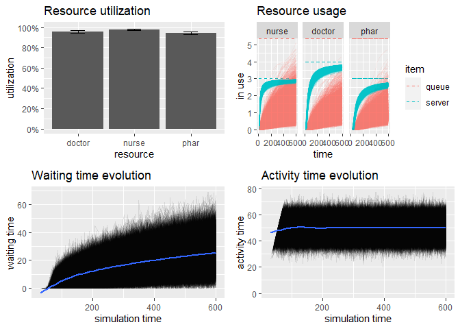

Economic evluation of resource utilization
================
Joshua Edefo
2024-01-08

Libraries

``` r
#Discrete event simulation
library(simmer)
```

    ## Warning: package 'simmer' was built under R version 4.3.2

``` r
library(simmer.plot)
```

    ## Warning: package 'ggplot2' was built under R version 4.3.2

``` r
library(magrittr)
library (gridExtra)
```

Out patient department

``` r
env<-simmer("outpatient_clinic")

env
```

    ## simmer environment: outpatient_clinic | now: 0 | next: 
    ## { Monitor: in memory }

``` r
# create patient trajectory
patient<-trajectory(name= "Patient Path", verbose = T)
patient
```

    ## trajectory: Patient Path, 0 activities

``` r
# draw model 
patient %>%
  
  seize("nurse", 1) %>%  ## need to define resources
  timeout(function() rnorm(1, 15, 3)) %>%
  release("nurse", 1) %>%
  
  seize("doctor", 1) %>% ## need to define resources
  timeout(function() rnorm(1, 20, 4)) %>%
  release("doctor", 1) %>%
  
  seize("phar", 1) %>% ## need to define resources
  timeout(function() rnorm(1, 15, 3.5)) %>%
  release("phar", 1)
```

    ## trajectory: Patient Path, 9 activities
    ## { Activity: Seize        |         0 <- 0x1962c74b368 -> 0x196270bc0e0 | resource: nurse, amount: 1 }
    ## { Activity: Timeout      | 0x1962c74b368 <- 0x196270bc0e0 -> 0x1962ab533d0 | delay: function() }
    ## { Activity: Release      | 0x196270bc0e0 <- 0x1962ab533d0 -> 0x1962c74b868 | resource: nurse, amount: 1 }
    ## { Activity: Seize        | 0x1962ab533d0 <- 0x1962c74b868 -> 0x196270bbf60 | resource: doctor, amount: 1 }
    ## { Activity: Timeout      | 0x1962c74b868 <- 0x196270bbf60 -> 0x1962ab53e50 | delay: function() }
    ## { Activity: Release      | 0x196270bbf60 <- 0x1962ab53e50 -> 0x1962c74b4a8 | resource: doctor, amount: 1 }
    ## { Activity: Seize        | 0x1962ab53e50 <- 0x1962c74b4a8 -> 0x196270bc3e0 | resource: phar, amount: 1 }
    ## { Activity: Timeout      | 0x1962c74b4a8 <- 0x196270bc3e0 -> 0x1962ab539d0 | delay: function() }
    ## { Activity: Release      | 0x196270bc3e0 <- 0x1962ab539d0 -> 0         | resource: phar, amount: 1 }

``` r
time1 = Sys.time()


envs<-lapply(1:10000, function(i) {
  simmer("outpatient clinic") %>%
    add_resource("nurse", 3) %>%
    add_resource("doctor", 4) %>%
    add_resource("phar", 3)%>% 
    add_generator("patient", patient,function()rnorm(1, 5, 0.5)) %>%
run(600) %>%
  wrap()
})

time2=Sys.time()
time2-time1
```

    ## Time difference of 1.688881 mins

``` r
resources<-get_mon_resources(envs)
p1=plot(resources, metric = "utilization")

p2=plot(resources, metric = "usage", c("nurse", "doctor", "phar"), items = c ("queue", "server"))

     
arrivals <- get_mon_arrivals (envs)

p3= plot (arrivals, metric="waiting_time") 

p4=plot (arrivals, metric="activity_time") 

grid.arrange(p1,p2,p3,p4)
```

    ## `geom_smooth()` using method = 'gam' and formula = 'y ~ s(x, bs = "cs")'
    ## `geom_smooth()` using method = 'gam' and formula = 'y ~ s(x, bs = "cs")'

<!-- -->

Session information

You can also embed plots, for example:

``` r
sessionInfo()
```

    ## R version 4.3.1 (2023-06-16 ucrt)
    ## Platform: x86_64-w64-mingw32/x64 (64-bit)
    ## Running under: Windows 11 x64 (build 22631)
    ## 
    ## Matrix products: default
    ## 
    ## 
    ## locale:
    ## [1] LC_COLLATE=English_United Kingdom.utf8 
    ## [2] LC_CTYPE=English_United Kingdom.utf8   
    ## [3] LC_MONETARY=English_United Kingdom.utf8
    ## [4] LC_NUMERIC=C                           
    ## [5] LC_TIME=English_United Kingdom.utf8    
    ## 
    ## time zone: Europe/London
    ## tzcode source: internal
    ## 
    ## attached base packages:
    ## [1] stats     graphics  grDevices utils     datasets  methods   base     
    ## 
    ## other attached packages:
    ## [1] gridExtra_2.3      magrittr_2.0.3     simmer.plot_0.1.18 ggplot2_3.4.4     
    ## [5] simmer_4.4.6.3    
    ## 
    ## loaded via a namespace (and not attached):
    ##  [1] Matrix_1.6-1.1    gtable_0.3.4      dplyr_1.1.3       compiler_4.3.1   
    ##  [5] tidyselect_1.2.0  Rcpp_1.0.11       tidyr_1.3.0       splines_4.3.1    
    ##  [9] scales_1.2.1      yaml_2.3.7        fastmap_1.1.1     lattice_0.21-8   
    ## [13] R6_2.5.1          labeling_0.4.3    generics_0.1.3    knitr_1.44       
    ## [17] tibble_3.2.1      munsell_0.5.0     pillar_1.9.0      rlang_1.1.1      
    ## [21] utf8_1.2.3        xfun_0.40         cli_3.6.1         withr_2.5.0      
    ## [25] mgcv_1.8-42       digest_0.6.33     grid_4.3.1        rstudioapi_0.15.0
    ## [29] nlme_3.1-162      lifecycle_1.0.3   vctrs_0.6.3       evaluate_0.21    
    ## [33] glue_1.6.2        farver_2.1.1      codetools_0.2-19  fansi_1.0.4      
    ## [37] colorspace_2.1-0  rmarkdown_2.25    purrr_1.0.2       tools_4.3.1      
    ## [41] pkgconfig_2.0.3   htmltools_0.5.6

The end
